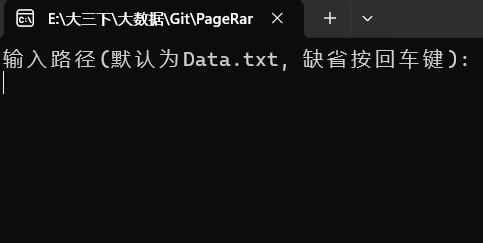
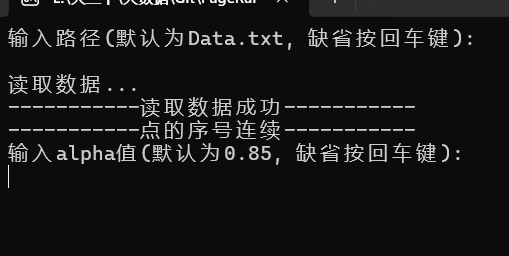
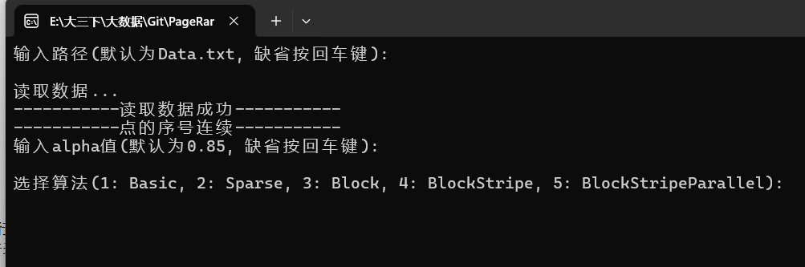
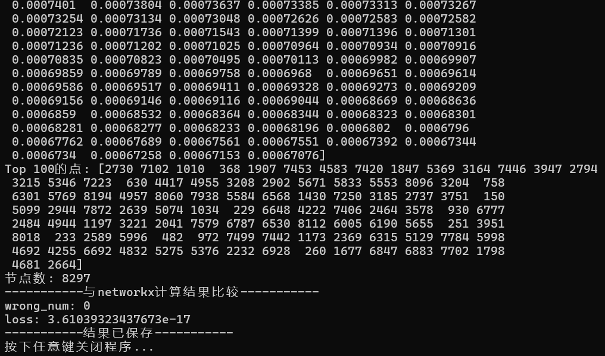

# PageRank
本项目文件结构如下：  
```
PageRank
│
├─results
│    ├─result.txt
│    ├─result_basic.txt
│    ├─result_block.txt
│    ├─result_block_stripe.txt
│    ├─result_sparse.txt
│
└─src
│    ├─main.py
│    ├─main.spec
│    ├─pagerank.py
│    ├─page_rank.ipynb
│    ├─utils.py
│
├─Data.txt
└─main.exe
```
main.py是主函数代码。  
main.exe是打包好的可执行文件，可以直接运行。运行结果会输出到results文件夹下的result.txt  
main.spec是打包main.py的配置文件。  
pagerank.py是PageRank算法的实现代码，包含了Basic基础算法，Sparse稀疏矩阵的优化算法，Block分块算法，Block+Stripe分块条带算法。Block+Stripe+Parallel分块条带并行算法。  
utils.py是一些工具函数，包括读取数据，保存结果，以及验证结果正确性的函数。  
Data.txt是数据输入文件。  
page_rank.ipynb是编程过程中的一些代码测试探索（为了方便编程的同时运行，将其保存为jupyter notebook），为最终形成完善的代码pagerank.py做准备。

## main.exe运行过程：
1. 选择数据输入，默认为同一目录下的Data.txt文件，显示“读取数据成功”即可完成数据的输入。  

2. 输入阻尼系数$\beta$，默认为0.85  

1. 然后可以选择使用哪一个PageRank算法，有Basic基础算法，Sparse稀疏矩阵的优化算法，Block分块算法，Block+Stripe分块条带算法。Block+Stripe+Parallel分块条带并行算法。  

1. 选择完算法后，等待程序运行一段时间，即可得到每一轮迭代的误差，当误差低于1e-6时，迭代结束，输出前100个节点，以及其对应的PageRank值。
同时会将其与调用networkx库运行的结果进行比较，测试代码是否排序正确，以及得到的PageRank值误差。  

1. 最终将结果保存到results\result.txt
